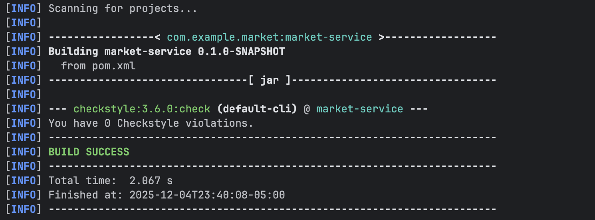
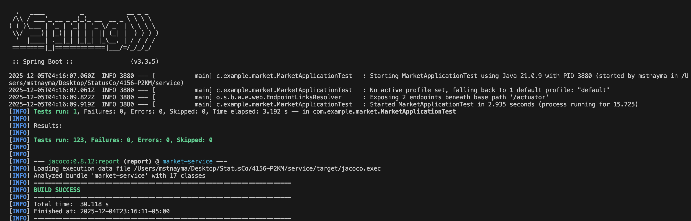
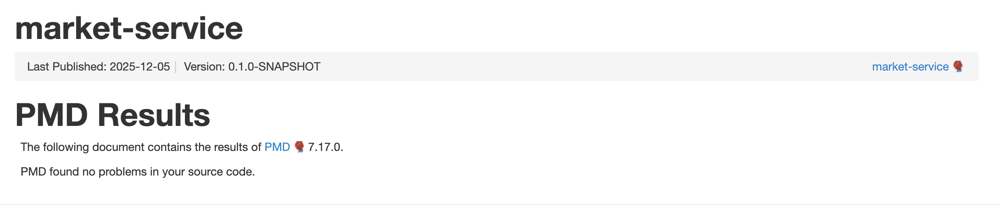
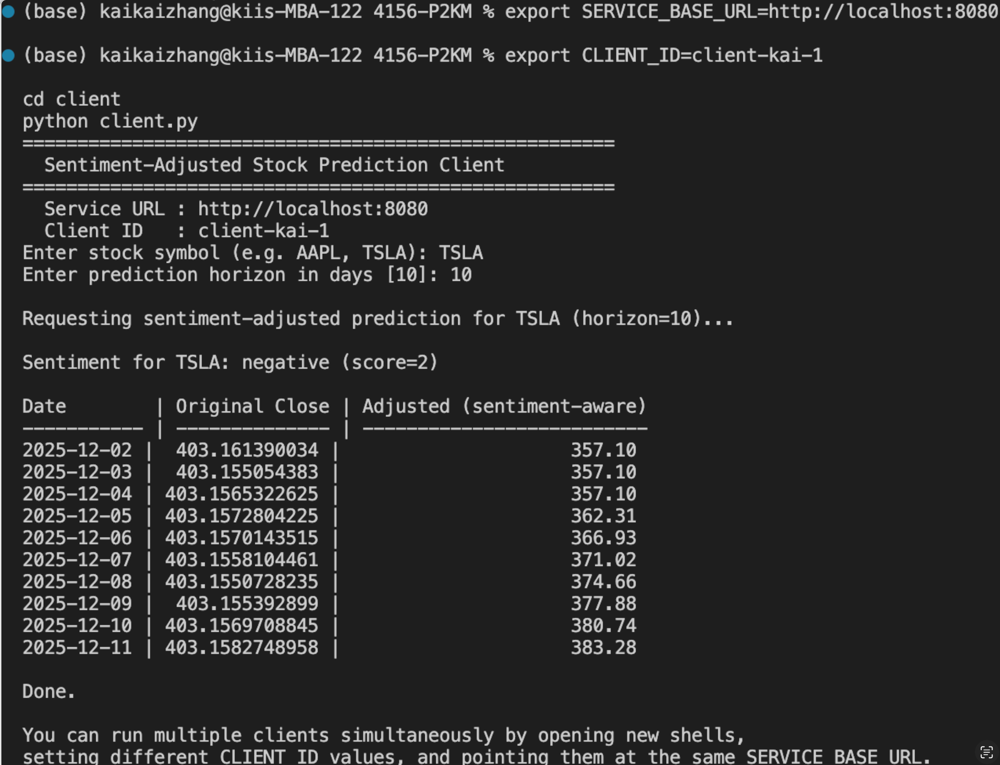

# StatusCo
A Financial Sentiment Analyzer ingests real-time market and news sentiment score data across tickers; enables stock predictions for the future.

## Building and Running a Local Instance

In order to build and use our service you must install the following (for Mac):
- Maven 3.9.5 - download following the instructions per this link: https://maven.apache.org/download.cgi
- JDK 21 - download following the instructions per this link: https://www.oracle.com/java/technologies/javase/jdk21-archive-downloads.html
- IntelliJ IDEA - download following the instructions per this link: https://www.jetbrains.com/idea/download/?section=mac
- Python 3.10.9 - download following the instructions per this link: https://www.python.org/downloads/release/python-3109/
- TrendMaster - download following the instructions per this link: https://github.com/hemangjoshi37a/TrendMaster/blob/main/docs/installation.md

## Microservice Architecture
The API architecture is built around four core microservices - **StockDataService**, **NewsDataService**, **ForecastDataService**, and **AdjustedPredictionService**. These services are unified through the **CompositeController**, which acts as the central RESTful interface that aggregates their outputs and delivers user-friendly responses to clients.

### 1. StockDataService (and Alpha Vantage)
Service exposing daily stock for a given ticker via Alpha Vantage.

Has a function ```fetchDaily(String symbol, String apiKey)``` that returns ```StockDailySeries```

* Builds and calls the external API given the ticker and API key: https://www.alphavantage.co/query?function=TIME_SERIES_DAILY&outputsize=full&symbol=<SYMBOL>&apikey=<KEY>. 
* Parses ```”Time Series (Daily)”``` into a ```List<StockBar>``` and returns a ```StockDailySeries``` with ticker, timestamp, source, and bars.


Has a function ```JsonNode getJson(String url)``` 
* Performs an HTTP GET to url, expects a 200 response, and parses the body into a Jackson JsonNode`.
* Used by ```StockDataService.fetchDaily``` to call external APIs and obtain a parsed JSON.


To operate this particular API service, 
- Run in terminal 1:
```
cd service
export ALPHAVANTAGE_API_KEY='<your_api_key>'
mvn spring-boot:run
```
- Run in terminal 2:
```
curl -i "http://localhost:8080/market/daily?symbol=AMZN"
```
### 2. NewsDataService
The NewsDataService handles sentiment analysis for a given company using a local Hugging Face model.
The service runs a Python script (sentiment_model.py) that uses the model nlptown/bert-base-multilingual-uncased-sentiment. 
This model analyzes generated text about the company and returns a sentiment score between 1 (very negative) and 5 (very positive), along with a descriptive label.

When ```/market/sentiment``` is called, the controller sends the request to NewsDataService, which then calls SentimentPythonService.
That service runs the Python script, which loads the Hugging Face model and produces a short JSON result.
The JSON is parsed in Java and returned through the API.

API endpoint:    
- ```GET /market/sentiment```

Query parameters:   
- ```symbol``` – optional; the company name or stock ticker to analyze (default is AMZN)    
- ```force``` – optional; set to true to bypass cached results and run a fresh analysis

Example requests:
- http://localhost:8080/market/sentiment
- http://localhost:8080/market/sentiment?symbol=TSLA
- http://localhost:8080/market/sentiment?symbol=META&force=true

Example response:

- {
  "company": "AMZN",
  "sentimentScore": 4,
  "sentimentLabel": "positive",
  "source": "HuggingFaceModel"
}

Start the service:
- Run in terminal 1:
```
cd service
mvn spring-boot:run
```
- Run in terminal 2: 
```
curl -i "http://localhost:8080/market/sentiment?symbol=AMZN"
```
The endpoint will return a JSON object with the sentiment score and label.

Setting up the Python environment (first time only):

The sentiment model runs through a Python script.
- If you haven’t set it up yet, do this once:

```
cd service/src/main/java/com/example/market/service/news/python
python3 -m venv venv
source venv/bin/activate
pip install transformers torch
python3 sentiment_model.py AMZN
```

This installs the required libraries and downloads the model.
After that, Spring Boot can call it automatically for future requests.

### 3. ForecastDataService
Spring Boot service that utilizes [Hemang Joshi](https://github.com/hemangjoshi37a)'s open-source library [TrendMaster](https://github.com/hemangjoshi37a/TrendMaster). 

It includes a helper class called PythonService, which executes a Python script running TrendMaster's forecasting model. 
The service then parses the script's JSON-formatted output and constructs a Map of dates and predicted prices for the ForecastDataService to use.

### 4. AdjustedPredictionService
Service that adjusts stock price predictions based on news sentiment analysis to produce sentiment-adjusted price forecasts.

Has a function ```adjustPricesWithSentiment(Map<String, String> stockPricePredictions, SentimentResult newsSentimentPrediction)``` that returns ```Map<String, String>```

* Takes price predictions from ForecastDataService and sentiment results from NewsDataService
* Uses a sophisticated non-linear formula with time decay to model how sentiment impacts future prices differently over time
* Applies sentiment adjustments that diminish over time (time decay factor of 0.12)
* Returns a map with the same date keys but sentiment-adjusted prices

To operate this particular API service, 
- Run in terminal 1:
```
cd service
export ALPHAVANTAGE_API_KEY='<your_api_key>'
mvn spring-boot:run
```
- Run in terminal 2:
```
curl -i "http://localhost:8080/market/combined-prediction" 
```

## Running Tests
To run our unit tests (located under the directory `src/test`), run the following command in the most outer `service` directory
```
mvn clean test
```

## Endpoints

```GET /market/daily``` — Returns cached-or-fresh Alpha Vantage daily OHLCV for the ticker (AMZN)

```GET /market/predict``` — Runs the placeholder forecast over the latest daily series (AMZN), returning a simple prediction map

```GET /market/sentiment``` — Returns a placeholder news-sentiment payload (AMZN), with optional force to bypass cache.

```GET /market/combined-prediction``` — Generates sentiment-adjusted stock price predictions by combining price forecasts with sentiment analysis. Returns both original predictions and sentiment-adjusted predictions.


## Style Checking Report
The tool "checkstyle" is used to check the style of our code and generate style checking reports. 
The following code can be run in terminal to check the checkstyle report.

1. `mvn checkstyle:check`
2. `mvn checkstyle:checkstyle`

Results:


## Branch Coverage Report
JaCoCo was used to perform branch analysis in order to see the branch coverage.
The following code can be run in terminal to check the checkstyle report.
1. `mvn clean test`
2. `mvn jacoco:report`
3. `open ./target/site/jacoco/index.html`

Results: 



## Static Code Analysis
PMD was used to perform static analysis on the codebase.
The following code can be run in terminal to check the PMD report.

1. `brew install pmd`
2. `mvn clean pmd:pmd`
3. `open target/site/pmd.html`

Results:


## Client Program

We include a simple Python CLI client in `client/client.py` that calls our service’s API and shows sentiment-adjusted price predictions.

### Prerequisites

- Python 3.10+ installed
- Service running locally or deployed (see “Deployment” section)
- Environment variables:
  - `SERVICE_BASE_URL` – base URL of the service, e.g.
    - `http://localhost:8080` (local)
    - `https://<your-cloud-run-url>` (cloud)
  - `CLIENT_ID` – optional string to identify this client instance in the service logs (e.g. `alice-laptop`)

Install dependencies:

```bash
cd client
python3 -m venv venv
source venv/bin/activate
pip install requests
```
###
Run the client
```bash
export SERVICE_BASE_URL=http://localhost:8080
export CLIENT_ID=client-kai-1

cd client
python client.py
```
The client will prompt you for:
- stock symbol (e.g. AAPL)
- prediction horizon in days

It then calls the /market/combined-prediction endpoint and prints a table like the one below:



### Multiple clients / how the service tells them apart
You can run multiple client instances at once by using different CLIENT_ID values:
```bash
# Terminal 1
export SERVICE_BASE_URL=https://<cloud-url>
export CLIENT_ID=desk-kai
python client.py

# Terminal 2
export SERVICE_BASE_URL=https://<cloud-url>
export CLIENT_ID=laptop-kiki
python client.py
```
Each client sends its id in the X-Client-Id HTTP header.
Our Spring service logs that header value for every incoming request, so we can distinguish which client made which call even if they are running simultaneously.

## Summary of Tools Used
- [Alpha Vantage](https://www.alphavantage.co/): Used for retrieving relevant stock data.
- [TrendMaster](https://github.com/hemangjoshi37a/TrendMaster): Used to generate stock price forecasts.
- [Jira](https://p2km.atlassian.net/jira/software/projects/BTS/boards/1): Used for managing timeline and project tasks

## AI Disclosure
We used the free version of ChatGPT to assist with debugging, drafting unit test, and wording.


---
